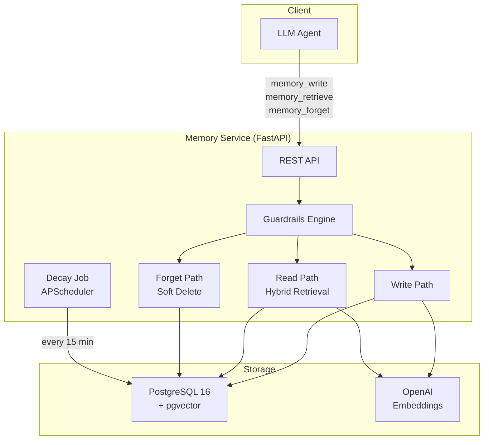

<div align="center">

# 🧠 Bitemporal AI Memory System

[](https://python.org)
[](https://fastapi.tiangolo.com)
[](https://postgresql.org)
[](https://github.com/pgvector/pgvector)
[](LICENSE)
[](https://github.com/swati21212004/bitemporal-memory/actions)

**Production-grade persistent memory layer for AI assistants**

*Semantic retrieval • Temporal decay • Bitemporal history • Behavioral guardrails*

[Features](#-features) • [Architecture](#-architecture) • [Quick Start](#-quick-start) • [API Reference](#-api-reference) • [Tool Definitions](#-tool-definitions)

</div>

---

## ✨ Features

- **🔍 Hybrid Retrieval** — 60% semantic similarity + 40% temporal decay scoring
- **⏳ Bitemporal History** — Track both "when it was true" and "when we recorded it"
- **🛡️ Contradiction Detection** — Never silently overwrites; surfaces conflicts to the user
- **🧹 Soft-Delete Only** — No data is ever permanently erased; full audit trail
- **📉 Adaptive Decay** — Memories fade naturally based on access patterns
- **🔧 Tool-Ready** — OpenAI function calling + Anthropic tool_use definitions included
- **🚦 Guardrails** — PII detection, rate limiting, deduplication, importance bounds
- **🐳 Docker-Ready** — One command to start everything

## 🏗️ Architecture



## 🚀 Quick Start

### Prerequisites
- Docker & Docker Compose
- OpenAI API key

### 1. Clone & Configure
```bash
git clone https://github.com/swati21212004/bitemporal-memory.git
cd bitemporal-memory
cp .env.example .env
# Edit .env and add your OPENAI_API_KEY
```

### 2. Start Services
```bash
docker-compose up -d
```

### 3. Try It Out
```bash
# Write a memory
curl -X POST http://localhost:8000/memories \
  -H 'Content-Type: application/json' \
  -d '{"content": "User prefers dark mode and minimal UI", "memory_type": "semantic", "importance": 0.8}'

# Search memories
curl -X POST http://localhost:8000/memories/search \
  -H 'Content-Type: application/json' \
  -d '{"query": "What UI preferences does the user have?", "top_k": 5}'

# Get system prompt context
curl http://localhost:8000/memories/system-prompt?user_id=default&top_k=10
```

### 4. Interactive Docs
Visit [http://localhost:8000/docs](http://localhost:8000/docs) for the Swagger UI.

## 📡 API Reference

| Method | Endpoint | Description |
|:-------|:---------|:------------|
| `POST` | `/memories` | Write a new memory (with contradiction detection) |
| `POST` | `/memories/search` | Hybrid semantic + decay search |
| `GET` | `/memories/{id}` | Get memory by ID |
| `GET` | `/memories/{id}/history` | Full bitemporal version history |
| `POST` | `/memories/{id}/forget` | Soft-delete a specific memory |
| `POST` | `/memories/forget-by-query` | Find and soft-delete matching memories |
| `GET` | `/memories/temporal` | "What did the system believe at time T?" |
| `POST` | `/memories/resolve-contradiction` | Explicitly resolve a detected contradiction |
| `GET` | `/memories/system-prompt` | Formatted memory block for LLM system prompt |
| `GET` | `/health` | Health check |

## 🔧 Tool Definitions

Ready-to-use tool definitions are included for:
- **OpenAI Function Calling**: `src/tools/openai_tools.py`
- **Anthropic Tool Use**: `src/tools/anthropic_tools.py`

### Example: OpenAI Integration

```python
from openai import OpenAI
from src.tools.openai_tools import MEMORY_TOOLS_OPENAI

client = OpenAI()
response = client.chat.completions.create(
    model="gpt-4o",
    messages=[{"role": "user", "content": "Remember that I prefer dark mode"}],
    tools=MEMORY_TOOLS_OPENAI,
)
```

### Example: Anthropic Integration

```python
from anthropic import Anthropic
from src.tools.anthropic_tools import MEMORY_TOOLS_ANTHROPIC

client = Anthropic()
response = client.messages.create(
    model="claude-sonnet-4-20250514",
    messages=[{"role": "user", "content": "Remember that I prefer dark mode"}],
    tools=MEMORY_TOOLS_ANTHROPIC,
)
```

## 📉 Decay Curve

The decay function `importance × 1/(1 + ln(1 + age_days))` provides natural memory fading:

| Age | Decay Factor |
|:----|:-------------|
| Just accessed | ≈ 1.00 |
| 1 day | ≈ 0.59 |
| 7 days | ≈ 0.34 |
| 30 days | ≈ 0.23 |
| 90 days | ≈ 0.18 |

## 🛡️ Guardrails

All guardrails are **code-enforced, not prompt-based**.

| Rule | Enforcement |
|:-----|:------------|
| Never silently resolve contradictions | Returns `409 Conflict` with both memories |
| Never hard delete | No `DELETE FROM` in codebase |
| Importance bounds | `0.0 ≤ importance ≤ 1.0` |
| PII detection | Regex scan, flags but stores |
| Source provenance | Every memory requires a source field |
| Rate limiting | 100 writes/min/user |
| Deduplication | Cosine > 0.95 → rejected |
| Staleness | Decay score < 0.05 → flagged |

## ⚙️ Configuration

All settings are configurable via environment variables. See [`.env.example`](.env.example).

| Variable | Default | Description |
|:---------|:--------|:------------|
| `DATABASE_URL` | `postgresql+asyncpg://...` | Async PostgreSQL connection string |
| `OPENAI_API_KEY` | — | OpenAI API key for embeddings |
| `EMBEDDING_MODEL` | `text-embedding-3-small` | OpenAI embedding model |
| `SEMANTIC_WEIGHT` | `0.6` | Weight for semantic similarity |
| `DECAY_WEIGHT` | `0.4` | Weight for decay score |
| `CONTRADICTION_THRESHOLD` | `0.85` | Cosine similarity for contradiction |
| `DEDUPLICATION_THRESHOLD` | `0.95` | Cosine similarity for dedup |
| `DECAY_JOB_INTERVAL_MINUTES` | `15` | Decay job frequency |
| `MAX_WRITES_PER_MINUTE` | `100` | Rate limit per user |
| `STALENESS_THRESHOLD` | `0.05` | Decay score below which memories are flagged |

## 🧪 Testing

```bash
# Run all tests
pytest tests/ -v

# Run specific test module
pytest tests/test_guardrails.py -v

# Run with coverage
pytest tests/ --cov=src --cov-report=term-missing
```

## 📁 Project Structure

```
bitemporal-memory/
├── .github/workflows/ci.yml   # GitHub Actions CI
├── src/
│   ├── api/                    # FastAPI route handlers
│   ├── guardrails/             # Deterministic behavioral guardrails
│   │   ├── __init__.py
│   │   └── rules.py            # GuardrailEngine + all checks
│   ├── jobs/                   # Scheduled background jobs (decay)
│   ├── models/                 # SQLAlchemy ORM models
│   │   └── memory.py           # Memory + MemoryAuditLog
│   ├── schemas/                # Pydantic v2 request/response schemas
│   │   └── memory.py
│   ├── services/               # Core business logic
│   │   ├── embedding.py        # OpenAI embedding service
│   │   ├── memory_forget.py    # Soft-delete operations
│   │   ├── memory_read.py      # Hybrid retrieval
│   │   └── memory_write.py     # Write + contradiction detection
│   ├── tools/                  # LLM tool definitions
│   │   ├── openai_tools.py     # OpenAI function calling format
│   │   └── anthropic_tools.py  # Anthropic tool_use format
│   ├── config.py               # Pydantic-settings config
│   └── database.py             # Async SQLAlchemy engine/session
├── tests/
│   ├── conftest.py             # Shared fixtures
│   ├── test_guardrails.py      # Guardrail engine tests
│   ├── test_write.py           # Write schema tests
│   ├── test_read.py            # Read schema tests
│   └── test_forget.py          # Forget schema tests
├── docker-compose.yml
├── Dockerfile
├── requirements.txt
└── README.md
```

## 📄 License

MIT
