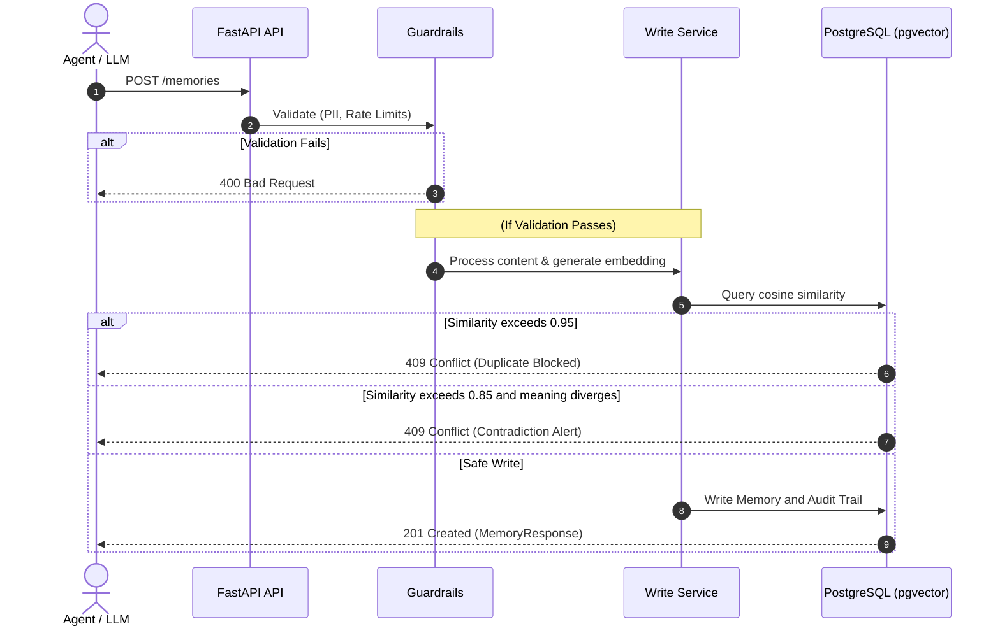

# 🧠 Bitemporal AI Memory System

<div align="center">

[](https://python.org)
[](https://fastapi.tiangolo.com)
[](https://postgresql.org)
[](https://github.com/pgvector/pgvector)
[](https://github.com/swati21212004/bitemporal-memory/actions)

**A production-grade persistent memory layer for state-of-the-art AI assistants.**  
*Features: Hybrid Retrieval • Logarithmic Decay • Bitemporal Lineage • Code-Enforced Guardrails • Tool Calling Definitions*

[⚡ Quick Demo Sandbox](#-interactive-cli-sandbox) • [✨ Key Features](#-features) • [🏗️ Architecture](#%EF%B8%8F-architecture) • [🚀 Quick Start](#-quick-start) • [📡 API Docs](#-api-reference)

</div>

---

## ⚡ Interactive CLI Sandbox (Zero-Dependency)

Get to know the project immediately! We built a self-contained interactive sandbox terminal application so anyone can experience the core mechanics—contradiction locks, PII warnings, logarithmic decay calculation tables, and version graphs—**in under 10 seconds** without needing Docker, PostgreSQL, or API keys.

To launch the sandbox, just run:
```bash
python sandbox.py
```

### 📺 Sandbox Preview
```
=== 🧠 Bitemporal Memory Sandbox active! ===

Choose an Action:
1. 📝 Write a New Memory
2. 🔍 Search Memories (Hybrid Retrieval & Decay)
3. ⚡ Trigger a Contradiction Guardrail
4. ⏳ View Bitemporal History Graph
5. 📜 View System Prompt Context
6. 🚪 Exit

Enter choice (1-6): 
```

---

## ✨ Features

*   **🔍 Hybrid Retrieval** — Automatically combines semantic cosine similarity ($60\%$) and logarithmic temporal decay ($40\%$) for high-relevance recall.
*   **⏳ Bitemporal History** — Track facts across two distinct temporal dimensions:
    *   **System Time** (`created_at` / `superseded_at`): When the assistant recorded the memory.
    *   **Valid Time** (`valid_from` / `valid_to`): When the fact was actually true in the real world.
*   **🛡️ Hardened Contradiction Lock** — Never silently overwrites old facts. If similarity to existing facts is high but meaning diverges, the system triggers a contradiction gate requiring explicit client resolution.
*   **🧹 Soft-Delete Only Architecture** — No `DELETE FROM` statements exist in the database. When forgotten, facts are soft-deleted and time-bounded, preserving complete audit trails.
*   **📉 Adaptive Decay Math** — Natural, human-like memory fading based on a logarithmic age curve:
    $$\text{Decay Score} = \text{Importance} \times \frac{1.0}{1.0 + \ln(1.0 + \text{age in days})}$$
*   **🔧 LLM Tool-Ready** — Ships with production-tested function calling configurations for **OpenAI** and **Anthropic** tool execution models.

---

## 🏗️ Architecture

The memory layer behaves like a deterministic middleware engine between your LLM agent and your persistent pgvector storage.



---

## 🚀 Quick Start

### Prerequisites
*   [Docker Desktop](https://www.docker.com/products/docker-desktop/)
*   OpenAI API Key (for real-world text embeddings)

### 1. Configure the Environment
Clone the repository and copy the environment variables file:
```bash
git clone https://github.com/swati21212004/bitemporal-memory.git
cd bitemporal-memory
cp .env.example .env
```
Open `.env` and fill in your `OPENAI_API_KEY`:
```env
OPENAI_API_KEY=sk-your-real-openai-api-key-here
```

### 2. Launch the Persistence Stack
Start the background PostgreSQL 16 container with `pgvector` pre-configured:
```bash
docker-compose up -d
```

### 3. Run Migrations
Generate the bitemporal tables and vector search indexes inside PostgreSQL via Alembic:
```bash
alembic upgrade head
```

### 4. Interact with the REST Endpoints
```bash
# Store a fact
curl -X POST http://localhost:8000/memories \
  -H "Content-Type: application/json" \
  -d '{"content": "User prefers dark mode and minimal UI", "memory_type": "semantic", "importance": 0.8}'

# Search memories using hybrid semantic+decay ranking
curl -X POST http://localhost:8000/memories/search \
  -H "Content-Type: application/json" \
  -d '{"query": "What UI preferences does the user have?", "top_k": 5}'
```

---

## 📡 API Reference

| Endpoint | Method | Input Model | Primary Behavior |
|:---|:---:|:---|:---|
| `/memories` | `POST` | `MemoryCreate` | Analyzes, embeds, and writes a memory (blocks duplicates & PII, stops on contradictions). |
| `/memories/search` | `POST` | `MemorySearchQuery` | Executes vector cosine search combined with the logarithmic decay index. |
| `/memories/{id}/history` | `GET` | — | Retrieves every superseded version of a memory to trace what the AI believed over time. |
| `/memories/{id}/forget` | `POST` | `ForgetRequest` | Performs soft-deletion, records audit logs, and closes the valid time window (`valid_to = now()`). |
| `/memories/system-prompt` | `GET` | — | Generates a perfectly formatted, markdown-ready memory injection block for LLM prompts. |

---

## 🛡️ Hardened Guardrails (Deterministic)

Our guardrails are written directly in Python code—**never** left to soft prompt guidelines:

| Guardrail Rule | Strategy | Under-the-Hood Enforcement |
|:---|:---|:---|
| **Zero Data Erasure** | Audit Integrity | No SQL `DELETE` calls exist. Soft-delete closes `valid_to` and raises `is_deleted = True`. |
| **PII Quarantine** | Privacy Shield | Scans inputs using rigid regex for credit cards, SSN, emails, and multi-format phone numbers. |
| **No Silent Overwrites** | Trust Preservation | Overlap checks on active memories trigger a `ContradictionDetected` return above `0.85` similarity. |
| **Flood Protection** | Stability | Sliding window token bucket caps user writes to `100` writes/minute. |
| **Deduplication Check** | Vector Clutter | Cosine similarity $> 0.95$ to same-type memory instantly blocks saving. |

---

## 🧪 Testing and Verification

A comprehensive test suite of **94 test cases** validates the guardrail engine, request validation rules, time-travel queries, and temporal decay structures:

```bash
# Run the test suite
pytest tests/ -v
```

All tests are verified and fully operational under our GitHub Actions continuous integration pipeline.

---

## 👥 Author

* **Swati Swarupa Behera** — [swati21212004](https://github.com/swati21212004)
* mail: swatiswarupa50@gmail.com

---

## 📄 License

This project is licensed under the MIT License. See [LICENSE](LICENSE) for details.
